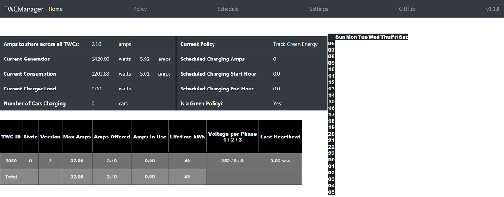

# TWCManager

## Screenshots

## How it works

* In order to allow multiple Tesla Wall Connector (TWC) units to operate on a single power circuit, Tesla provides a Load-Sharing protocol to interconnect the Tesla Wall Connector units together, and to direct those units to charge at a specific rate based on the number of cars charging simtultaneously.
* This script (TWCManager) pretends to be a Tesla Wall Charger (TWC) set to master mode.
* When wired to the IN or OUT pins of real TWC units set to slave mode (rotary switch position F), TWCManager can tell them to limit car charging to any whole amp value between 5A and the max rating of the charger. Charging can also be stopped so the car goes to sleep.
* This level of control is useful for having TWCManager track the real-time availability of green energy sources and direct the slave TWCs to use near the exact amount of energy available. This saves energy compared to sending the green energy off to a battery for later car charging or off to the grid where some of it is lost in transmission (and costs are greater than charging off generated solar).
* TWCManager provides built-in interfaces to several different Green Energy interfaces, to allow this tracking. Please see the table below.

## Interfaces

To enable TWCManager to gather the solar generation information that it requires to adjust the charging rate, we provide Interfaces to allow information to be retrieved (EMS Interfaces) and Interfaces to allow us to provide information to external systems to inform them of current charging output and number of cars currently charging.

### Control Interfaces

| Platform         | Status           | Details                 |
| ---------------- | ---------------- | ----------------------- |
| [HTTPControl](docs/modules/Control_HTTP.md) | Available v1.1.3 | Allows control via embedded HTTP server (with RESTful API interface) |
| [MQTTControl](docs/modules/Control_MQTT.md) | Available v1.1.2 | Allows control via MQTT |
| [WebIPCControl](docs/modules/Control_WebIPC.md) | Available v1.1.4 | Allows control via PHP scripts (sysv IPC) |

### EMS Interfaces

EMS Interfaces read solar generation and/or consumption values from an external system. Current EMS interfaces are:

| Platform         | Status        | Details                 |
| ---------------- | ------------- | ----------------------- |
| Dutch SmartMeter | In Development | Supports DSMR Serial Protocol |
| [Fronius Inverter](docs/modules/EMS_Fronius.md) | Available v1.1.0 | Allows fetching generation and consumption from Fronius Inverter API |
| [HomeAssistant](docs/modules/EMS_HASS.md) | Available v1.0.1 | Allows fetching generation and consumption from HomeAssistant sensors |
| [SolarEdge](docs/modules/EMS_SolarEdge.md) | Available v1.2.0 | Support for fetching generation values from SolarEdge API |
| [Tesla Powerwall2](docs/modules/EMS_Powerwall2.md) | Available v1.1.3 | Support for fetching Consumption and Generation from Tesla Powerwall 2 |
| [The Energy Detective](docs/modules/EMS_TED.md) | Available v1.1.2 | Support for TED (The Energy Detective) |

### Status Interfaces

Status interfaces publish TWCManager status information to external systems. Current Status interfaces are:

| Platform         | Status           | Details                 |
| ---------------- | ---------------- | ----------------------- |
| [HomeAssistant](docs/modules/Status_HASS.md) | Available v1.0.1 | Provides HASS sensors to monitor TWCManager State |
| [MQTT](docs/modules/Status_MQTT.md) | Available v1.0.1 | Publishes MQTT topics to monitor TWCManager State |

### Vehicle Interfaces

| Platform    | Status           | Details                 |
| ----------- | ---------------- | ----------------------- |
| TeslaAPI    | Available v1.0.0 | Allows start/stop charging via Tesla API |

## Warnings

It is important to read and understand the following warnings before using this tool:

* Misuse of the protocol described in this software can direct a Tesla Wall Charger to supply more current to a car than the charger wiring was designed for.
* This will trip a circuit breaker or may start a fire in the unlikely event that the circuit breaker fails.
* This software was not written or designed with the benefit of information from Tesla and there is always a small possibility that some unforeseen aspect of its operation could damage a Tesla vehicle or a Tesla Wall Charger.
* All efforts have been made to avoid such damage and this software is in active use on the author's own vehicle and TWC.
* In short, USE THIS SOFTWARE AT YOUR OWN RISK.

## Features
* Can be set up to only allow charging during certain hours.
* Lets you control the amount of power delivered by a Tesla Wall Connector (TWC) to the car it is charging.
This can save around 6kWh per month when used to track a local green energy source like solar panels on your roof.  It can also avoid drawing grid energy for those without net metering or limit charging to times of day when prices are cheapest.
* Whilst the TWCManager application cannot read the charge state of connected vehicles, using the Tesla API we can pull the charge status of a vehicle.
* Integrates with Status modules to report TWC sensor data to external syustems for display or use in automations.

## Limitations
* Due to hardware limitations, TWCManager will not work with Tesla's older High Power Wall Connectors (HPWCs) that were discontinued around April 2016.
* We do not currently have enough information about the new 2020 Tesla Wall Connector devices with WiFi to understand if they will be compatible in any way (wired or wireless) with TWCManager.
* There is currently no way to configure how TWCManager deals with more than one interface platform. Currently, TWCManager will add together the values (generation and consumption) for all configured integrations.

## Installation

All installation documentation (Physical and Software) is contained in the documentation repository [here](docs/README.md)

# Attribution
* Original TWCManager distribution by [cdragon](https://github.com/cdragon/TWCManager)
   * The effort by @cdragon cannot be understated, if you would like to read more about the intense hardware hacking that was done to make this project a reality, read this [thread](https://teslamotorsclub.com/tmc/threads/new-wall-connector-load-sharing-protocol.72830).
* Integrated improvements from [flodom's](https://github.com/flodorn/TWCManager) TWCManager fork. 
    * Support for multiple vehicles on multiple chargers
    * Support for publishing status to MQTT topics
