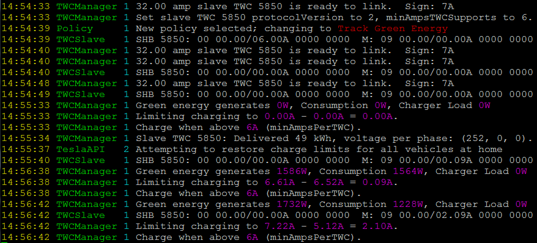
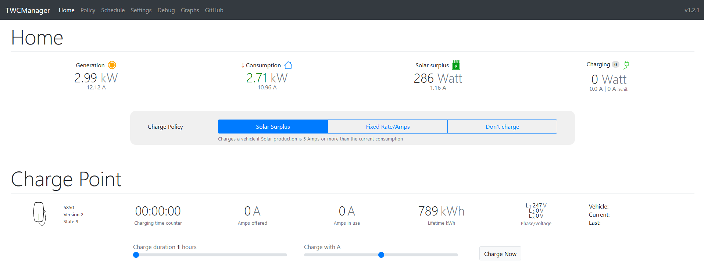

# TWCManager

## Screenshots

## How it works

* In order to allow multiple Tesla Wall Connector (TWC) units to operate on a single power circuit, Tesla provides a Load-Sharing protocol to interconnect the Tesla Wall Connector units together, and to direct those units to charge at a specific rate based on the number of cars charging simtultaneously.
* This script (TWCManager) pretends to be a Tesla Wall Charger (TWC) set to master mode.
* When wired to the IN or OUT pins of real TWC units set to slave mode (rotary switch position F), TWCManager can limit car charging based on information from inverters and panels.
* This allows us to:
    * Track the real-time availability of green energy sources (including PV Inverters, Battery Systems and Weather APIs) and direct the slave TWCs to use near the exact amount of energy available for the current conditions.
    * Send on-demand commands to TWC devices to charge at specified rates and times.
    * Schedule charging to occur at regular intervals.
    * Control which vehicles can and cannot use a TWC device based on VIN (for supported vehicles and TWCs).

Would you like a full list of features available in TWCManager? Click [here](docs/Features.md)

## Installation and Configuration

All installation and configuration documentation (Physical and Software) is contained in the documentation repository [here](docs/README.md)

## Interfaces

To enable TWCManager to gather the solar generation information that it requires to adjust the charging rate, we provide Interfaces to allow information to be retrieved (EMS Interfaces) and Interfaces to allow us to provide information to external systems to inform them of current charging output and number of cars currently charging.

### Communication Interfaces
| Platform                                 | Details                 |
| ---------------------------------------- | ----------------------- |
| [Dummy](docs/modules/Interface_Dummy.md) | Interface to simulate a TWC device for testing   |
| [RS485](docs/modules/Interface_RS485.md) | Communicate over RS485 Serial or basic TCP communications |
| [TCP](docs/modules/Interface_TCP.md)     | Communicate over more complex TCP network channels (In Development) |

### Control Interfaces

| Platform                            | Details                 |
| ----------------------------------- | ----------------------- |
| [HTTPControl](docs/modules/Control_HTTP.md) | Allows control via embedded HTTP server (with RESTful API interface) |
| [MQTTControl](docs/modules/Control_MQTT.md) | Allows control via MQTT |
| [OCPPControl](docs/modules/Control_OCPP.md) | Allows integration with [OCPP](https://pypi.org/project/ocpp/) |
| [WebIPCControl](docs/modules/Control_WebIPC.md) | Allows control via PHP scripts (sysv IPC) |

### EMS Interfaces

EMS Interfaces read solar generation and/or consumption values from an external system. Current EMS interfaces are:

| Platform                      | Status        | Details                 |
| ----------------------------- | ------------- | ----------------------- |
| Dutch SmartMeter | In Development | Supports DSMR Serial Protocol |
| [Efergy](docs/modules/EMS_Efergy.md)            | Available | Supports Efergy Pro Sensors |
| [Enphase](docs/modules/EMS_Enphase.md)          | Available | Supports Enphase Enlighten API |
| [Fronius Inverter](docs/modules/EMS_Fronius.md) | Available | Supports Fronius Inverter API |
| [Growatt](docs/modules/EMS_Growatt.md)          | Available | Support for Growatt Battery systems |
| [HomeAssistant](docs/modules/EMS_HASS.md)       | Available | Supports HomeAssistant sensors |
| [IoTaWatt](docs/modules/EMS_Iotawatt.md)       | Available | Supports Iotawatt outputs |
| [Kostal (Pico/Plenticore)](docs/modules/EMS_Kostal.md) | Available | Support for Kostal Inverters via ModBus |
| [Open Energy Monitor](docs/modules/EMS_EmonCMS.md) | Available | Support [Open Energy Monitor](https://openenergymonitor.org) integration |
| [openHAB](docs/modules/EMS_OpenHab.md)          | Available | Supports openHAB items |
| [OpenWeatherMap](docs/modules/EMS_OpenWeatherMap.md) | Available | Supports OpenWeatherMap forecast-based tracking where inverter EMS is not available. |
| [P1 Monitor](docs/modules/EMS_P1Monitor.md)     | Available | Supports P1 Monitor (Energy Monitoring tool for Pi) |
| [SmartMe](docs/modules/EMS_SmartMe.md)          | Available | Support for smart-me.com API |
| [SmartPi](docs/modules/EMS_SmartPi.md)          | Available | Support for SmartPi Smart Meter |
| [SolarEdge](docs/modules/EMS_SolarEdge.md)      | Available | Support for SolarEdge API |
| [SolarLog](docs/modules/EMS_SolarLog.md)        | Available | Supports SolarLog Base API |
| [Tesla Powerwall2](docs/modules/EMS_Powerwall2.md) | Available | Support for Tesla Powerwall 2 |
| [The Energy Detective](docs/modules/EMS_TED.md) | Available | Support for TED (The Energy Detective) |
| [URL](docs/modules/EMS_URL.md)  | Available | Support for URL based generation/consumption values (eg Node-RED) |
| [Volkszähler](docs/modules/EMS_Volkszahler.md)  | Available | Support for Volkszahler |

### Logging Interfaces

Logging interfaces allow recording of statistics and values such as Green Energy data, Slave TWC status and Voltage and Amperage data to various interfaces.

This can be useful if you would like to track charger activity and use it for graphing or statistics purposes.

| Module                                     | Details                       |
| ------------------------------------------ | --------------------------    |
| [Console](docs/modules/Logging_Console.md) | Print output to console       |
| [CSV](docs/modules/Logging_CSV.md)         | Log data to CSV files         |
| [Files](docs/modules/Logging_Files.md)     | Log data to a log files       |
| [MySQL](docs/modules/Logging_MySQL.md)     | Log data to a MySQL Database  |
| [Sentry](docs/modules/Logging_Sentry.md)   | Log data to a Sentry project  |
| [SQLite](docs/modules/Logging_SQLite.md)   | Log data to a SQLite Database |

### Status Interfaces

Status interfaces publish TWCManager status information to external systems. Current Status interfaces are:

| Platform                                     | Details                 |
| -------------------------------------------- | ----------------------- |
| [HomeAssistant](docs/modules/Status_HASS.md) | Provides HASS sensors to monitor TWCManager State |
| [MQTT](docs/modules/Status_MQTT.md)          | Publishes MQTT topics to monitor TWCManager State |

### Vehicle Interfaces

| Platform    | Details                                  |
| ----------- | ---------------------------------------- |
| TeslaAPI    | Allows start/stop charging via Tesla API |
| [TeslaMate](docs/modules/Vehicle_TeslaMate.md) | TeslaMate integration (Tesla API Tokens) |

## Warnings

It is important to read and understand the following warnings before using this tool:

* Misuse of the protocol described in this software can direct a Tesla Wall Charger to supply more current to a car than the charger wiring was designed for.
* This will trip a circuit breaker or may start a fire in the unlikely event that the circuit breaker fails.
* This software was not written or designed with the benefit of information from Tesla and there is always a small possibility that some unforeseen aspect of its operation could damage a Tesla vehicle or a Tesla Wall Charger.
* All efforts have been made to avoid such damage and this software is in active use on the author's own vehicle and TWC.
* In short, USE THIS SOFTWARE AT YOUR OWN RISK.

## Limitations
* Due to hardware limitations, TWCManager will not work with Tesla's older High Power Wall Connectors (HPWCs) that were discontinued around April 2016.
* We do not currently have enough information about the new 2020 Tesla Wall Connector devices with WiFi to understand if they will be compatible in any way (wired or wireless) with TWCManager.

## Attribution
* Original TWCManager distribution by [cdragon](https://github.com/cdragon/TWCManager)
   * The effort by @cdragon cannot be understated, if you would like to read more about the intense hardware hacking that was done to make this project a reality, read this [thread](https://teslamotorsclub.com/tmc/threads/new-wall-connector-load-sharing-protocol.72830).
* Integrated improvements from [flodom's](https://github.com/flodorn/TWCManager) TWCManager fork. 
    * Support for multiple vehicles on multiple chargers
    * Support for publishing status to MQTT topics
