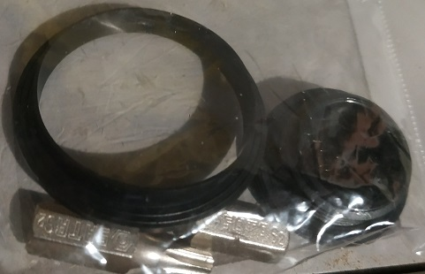
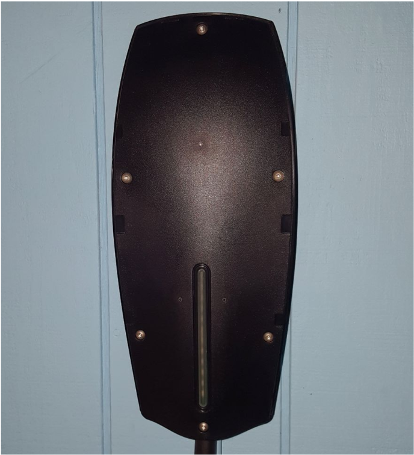
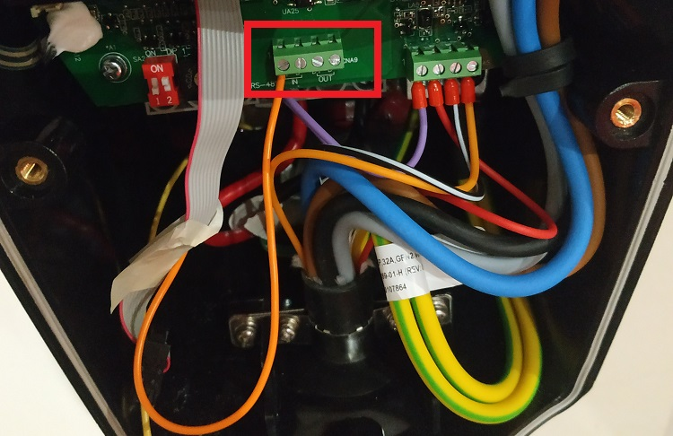
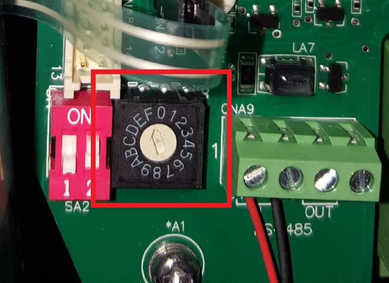

# Installation Guide

## Before You Begin

The following steps will involve opening your Tesla Wall Charger (TWC) chassis cover for the purpose of connecting RS-485 wires to a number of terminals on the TWC. These terminals are adjacent to live components within the Tesla Wall Charger, and the risk of electrocution if appropriate safety steps are not taken is **high**.

The installation does not require a great amount of electrical skill or competence, but it does involve serious voltages and currents, and for that reason, the guide will stress repeatedly the proper implementation of safety process throughout. The last thing I would want is for anyone to harm following this tutorial and for that reason I would stress that **if you are not confident that you understand the risks involved and could take the necessary steps throughout this process to protect yourself from electrocution, please do not attempt this, please ask your electrician for assistance**.

  * If you are not confident or comfortable with the modification of the TWC installation, please stop here.
  * If you do not have access to a (or several) isolation devices to entirely de-energise the TWC during the installation, please stop here.
  * Remember that you can always ask your electrician to run these wires (safely) for you.

## Basic Installation

The basic installation approach consists of a pair of wires being installed into the RS-485 sockets of the Tesla Wall Charger, with an external device providing an RS-485 interface on which TWCManager communicates with the TWC to limit the charge based on the current Generation and Consumption rates of your solar installation.

**Pros**
  * Simpler installation, only requires feeding some wires through an existing entry point into the TWC.
  * Significantly less risk, as the advanced connection relies on storing a Raspberry Pi controller inside of the TWC and powering it from the LED display on the charger.

**Cons**
  * There is some visible external egress of these wires to connect to the controlling device.
     * This can be mitigated through running the cables through wall cavities, however for the sake of simplicity, this document will only deal with running the wires through visibly.

### Tools Required

You will need:

  * Some wire - 22 AWG guage wire is recommended.
  * An RS-485 interface. The easiest way to achieve this is a USB to RS-485 adapter. If using this adapter, I can recommend a USB-RS485-WE-1800-BT adapter, which both my and cdragon's installations have used. This has a FTDI chip and has been extremely stable in my testing.
  * A computer to run TWCManager on. A Raspberry Pi Zero W is recommended, as it has a low energy consumption. 
  * TT10 and TT20 "security" Torx Screw bits. The Tesla Wall Connector comes with a set of these torx bits included, it is in a package with some rubber grommets for the Wall Connector:
  

### Remove the Cover

The first step is to remove the silver/grey TWC charger cover. This is held in by a Torx TT10 (the smaller bit) screw at the bottom of the unit. Loosen this screw and remove it carefully, as there are no spares provided with the unit. Be careful! This component is quite brittle. My electrician managed to crack mine when applying a little too much force.

### Opening the Charger

Behind the TWC cover is another cover, which isolates all of the live components from the user. Once you open this cover, the wires covering live voltage will be exposed, so please **ensure the unit is isolated** at this point. This cover is held in place with Torx TT20 screws (the larger bit). **It is recommended that you be very careful removing these screws** as there are no spares provided, and they have a special coating on the back which acts as a waterproof gasket to ensure no water ingress to the unit. This is especially important in an outdoor installation.

### RS-485 Connection

Once you have removed the Tesla Wall Charger cover, you should see a set of 4 headers for RS-485 communication, in the centre of the unit. The header is highlighted in the following picture. Note that in the picture, one of the two RS-485 wires has already been attached.

You may connect your RS-485 wires to either the In or the Out (but not both) header pins. To do this, you'll need a 3mm flat-head screwdriver. Strip approximately 3mm of insulation from the wires that you will be connecting, and feed them from the bottom of the RS-485 headers into the positive or negative terminals for either the In or Out headers.

Generally, the wires that you connect will be the following colours:

  * Positive: Orange or Red
  * Negative: Yellow or Black
  
Please check carefully with the documentation for your RS-485 interface. If you get this wiring wrong, it's possible that you'll feed power to the RS-485 header, potentially damaging the TWC.

### Rotary Switch

Identify the Rotary Switch, which is to the left of the RS-485 header. 

This switch controls the amperage of the Tesla Wall Charger. Note down the original setting for your TWC. This will need to be changed to location F, in order to set the TWC to Slave Mode.

#### Europe / Oceania

| Rotary Switch | Maximum Output Current |
| ------------- | ---------------------- |
| 0             | Test Mode              |
| 1             | 6A                     |
| 2             | 8A                     |
| 3             | 10A                    |
| 4             | 13A                    |
| 5             | 16A                    |
| 6             | 20A                    |
| 7             | 25A                    |
| 8             | 32A                    |
| F             | Slave Mode             |

#### North America

| Rotary Switch | Maximum Output Current |
| ------------- | ---------------------- |
| 0             | Test Mode              |
| 1             | 12A                    |
| 2             | 16A                    |
| 3             | 20A                    |
| 4             | 24A                    |
| 5             | 28A                    |
| 6             | 32A                    |
| 7             | 36A                    |
| 8             | 40A                    |
| 9             | 48A                    |
| A             | 56A                    |
| B             | 64A                    |
| C             | 72A                    |
| D             | 80A                    |
| E             | Not valid              |
| F             | Slave Mode             |

## Expert Installation

The Expert Installation approach is not recommended for most users due to the
inherent difficulty of the installation process.  However, if you are
comfortable with cutting and soldering wires, the process is not overly
complicated.

Full details are [here](TWCManager%20Installation.pdf), but the process consists
of building an adapter cable to power the Raspberry Pi (5V) from the TWC's own
internal low-voltage components.

The following pieces are required:

- Heat shrink
- [UBEC 5V buck converter](https://www.adafruit.com/product/1385)
- [Male](https://www.digikey.com/product-detail/en/3m/4610-6051/MPK10K-ND/138305) and
  [female](https://www.digikey.com/product-detail/en/3m/89110-0101/MKC10A-ND/229690)
  IDC connectors, with a
  [ribbon cable](https://www.digikey.com/product-detail/en/3m/3365-10-300SF/MC10G-5-ND/145432)
  to connect them
- Optionally, a spare micro-USB cable

The TWC provides 14V low voltage to the front panel LEDs; this is the connector
you unplug to remove the inner cover.  The IDC connectors allow tapping this 14V
source, and the buck converter steps the 14V source down to 5V to power the
Raspberry Pi.

The output of the UBEC can be soldered directly to the Raspberry Pi's GPIO board
if you are very handy with fine soldering.  Alternatively, cut off the micro-USB
end of your spare cable, solder the UBEC's output to the red and black wires,
and power the Pi via USB as usual.

Use heat shrink to cover all exposed metal to reduce the risk of inadvertent
shorts or contact with the TWC's high-voltage components.
